## Atividade Prática - API e Consultas 

## Sobre o projeto

Este projeto consiste em uma API desenvolvida em PHP para auxiliar no gerenciamento de peças armazenadas em um almoxarifado.

A aplicação permite realizar o cadastro de novas peças, consultar os registros existentes, alterar informações e remover peças. Os dados são armazenados em um banco PostgreSQL e as informações trocadas com a API utilizam o formato JSON.

## Ferramentas utilizadas

- PHP
- PostgreSQL
- PDO
- JSON
- Thunder Client

## Estrutura do banco

Foi criado um banco de dados chamado `almoxarifado`.

```sql
CREATE DATABASE almoxarifado;
```

Dentro do banco foi criada a tabela `pecas`:

```sql
CREATE TABLE pecas (
    id SERIAL PRIMARY KEY,
    nome VARCHAR(100) NOT NULL,
    categoria VARCHAR(20) NOT NULL,
    fornecedor VARCHAR(100) NOT NULL,
    quantidade INTEGER NOT NULL,
    preco_unitario DECIMAL(10,2) NOT NULL
);
```

### Informações armazenadas

| Campo | Tipo | Função |
|---|---|---|
| id | SERIAL | Código único da peça |
| nome | VARCHAR | Nome da peça |
| categoria | VARCHAR | Tipo da peça |
| fornecedor | VARCHAR | Empresa fornecedora |
| quantidade | INTEGER | Número de unidades disponíveis |
| preco_unitario | DECIMAL | Valor de uma unidade |

As categorias utilizadas no cadastro são:

- `eletrica`
- `mecanica`
- `hidraulica`

A API também verifica se a quantidade é válida e se o preço informado é maior que zero.

## Arquivos do projeto

```text
almoxarifado/
├── conexao.php
├── pecas.php
└── README.md
```

### conexao.php

Responsável por estabelecer a conexão entre o PHP e o PostgreSQL através do PDO.

### pecas.php

É o arquivo principal da API. Nele estão implementadas as operações de cadastro, consulta, alteração e exclusão.

---

# Operações da API

## 1. Cadastrar uma peça - POST

Para inserir uma nova peça, é utilizado o método `POST`.

**Endereço:**

```text
http://localhost:8000/pecas.php
```

**Método:**

```text
POST
```

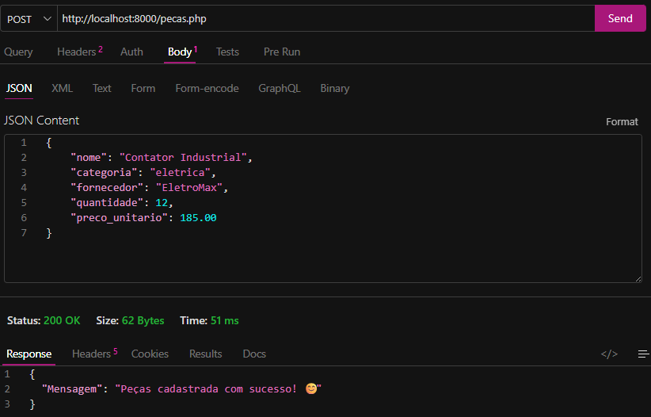

---

## 2. Consultar peças - GET

O método `GET` é utilizado para visualizar os registros armazenados.

**Endereço:**

```text
http://localhost:8000/pecas.php
```

**Método:**

```text
GET
```
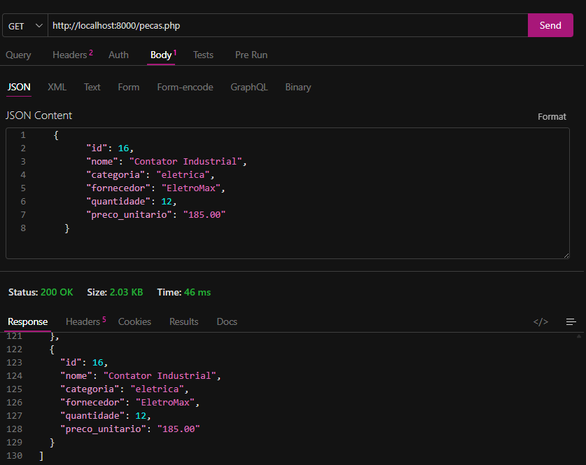

A API retorna uma lista contendo as peças cadastradas.

---

## 3. Alterar uma peça - PUT

O método `PUT` permite modificar os dados de uma peça existente.

Para identificar qual registro será alterado, o `id` é informado na URL.

**Endereço:**

```text
http://localhost:8000/pecas.php?id=1
```

**Método:**

```text
PUT
```

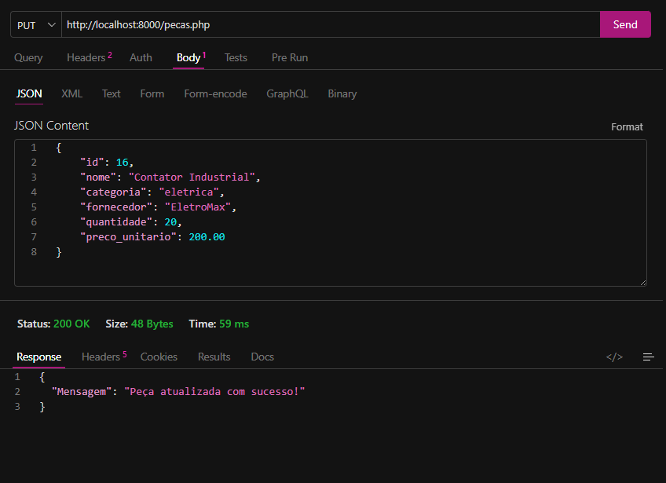

---

## 4. Remover uma peça - DELETE

Para apagar uma peça, é utilizado o método `DELETE`.

O `id` do registro é informado na URL.

**Endereço:**

```text
http://localhost:8000/pecas.php?id=1
```

**Método:**

```text
DELETE
```

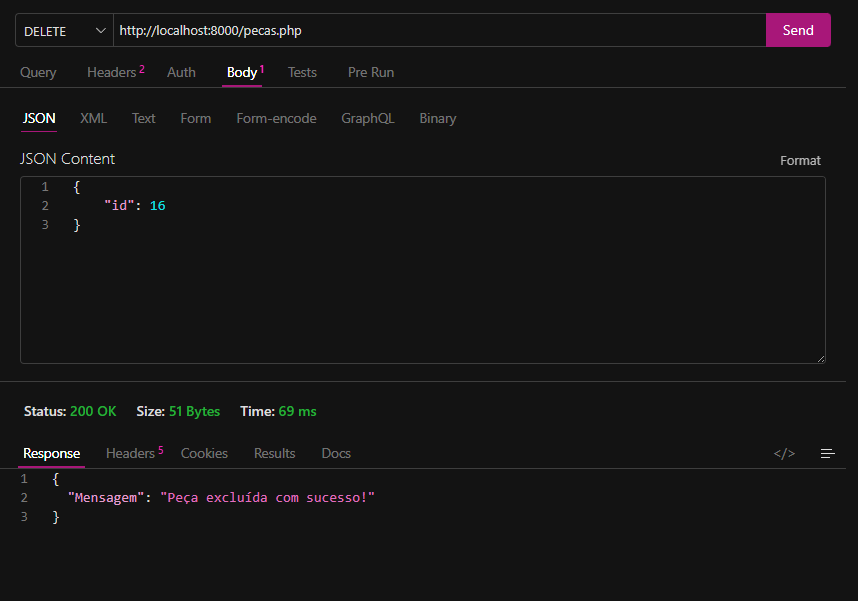

---

# Dados cadastrados

Para testar o funcionamento da API, foram inseridas **15 peças utilizando o método POST**.

Os registros foram distribuídos entre as três categorias:

- Elétrica
- Mecânica
- Hidráulica

Também foram utilizados diferentes fornecedores, quantidades e preços para que fosse possível realizar as consultas de análise do estoque.

Os testes dos cadastros foram realizados através do **Thunder Client**.

**Tabela:**

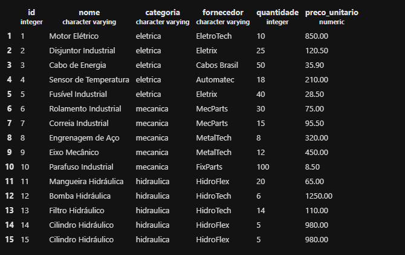

---

# Consultas para análise do estoque

Depois dos cadastros, foram realizadas algumas consultas SQL para obter informações sobre o estoque.

## 1. Total de unidades armazenadas

A função `SUM()` foi utilizada para somar todas as quantidades:

```sql
SELECT SUM(quantidade) AS total_unidades
FROM pecas;
```

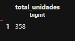
O `AS` cria o nome `total_unidades` para o resultado.

---

## 2. Valor total do estoque

Para descobrir quanto dinheiro está armazenado em peças, a quantidade de cada item é multiplicada pelo seu preço:

```sql
SELECT SUM(quantidade * preco_unitario) AS valor_total_estoque
FROM pecas;
```

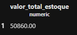
Dessa forma, são consideradas todas as unidades existentes de cada peça.

---

## 3. Maior preço unitário

A função `MAX()` identifica o maior preço cadastrado:

```sql
SELECT MAX(preco_unitario) AS maior_preco
FROM pecas;
```

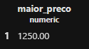

---

## 4. Menor preço unitário

A função `MIN()` retorna o menor preço encontrado:

```sql
SELECT MIN(preco_unitario) AS menor_preco
FROM pecas;
```

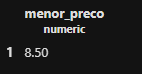

---

## 5. Média dos preços

Para calcular o preço médio foi utilizada a função `AVG()`.

A função `ROUND()` deixa o resultado com duas casas decimais:

```sql
SELECT ROUND(AVG(preco_unitario), 2) AS preco_medio
FROM pecas;
```

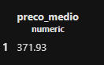

---

## 6. Estoque da categoria elétrica

Para analisar somente as peças elétricas, foi utilizado o `WHERE`:

```sql
SELECT SUM(quantidade * preco_unitario) AS valor_total_eletrica
FROM pecas
WHERE categoria = 'eletrica';
```

Essa consulta calcula o valor total das unidades pertencentes apenas à categoria `eletrica`.

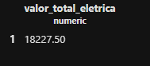

---

# Validação dos dados

A API possui algumas verificações antes de realizar as operações.

A categoria deve ser uma das seguintes:

```text
eletrica
mecanica
hidraulica
```

A quantidade não pode possuir valor negativo e o preço unitário precisa ser maior que zero.

Também é verificado se os campos necessários foram enviados na requisição.

---

# Testes realizados

As requisições foram verificadas no **Thunder Client**, utilizando os métodos:

```text
POST   → cadastro
GET    → consulta
PUT    → alteração
DELETE → exclusão
```

Também foram executadas as consultas SQL diretamente no PostgreSQL para verificar as informações relacionadas ao estoque.

# Resultado

Com a implementação da API, foi possível criar um sistema simples para controlar as peças do almoxarifado.

O projeto também permitiu praticar a integração entre **PHP e PostgreSQL**, o uso de **PDO**, troca de informações em **JSON**, operações de **CRUD** e funções de consulta SQL como `SUM`, `MAX`, `MIN`, `AVG` e `ROUND`.